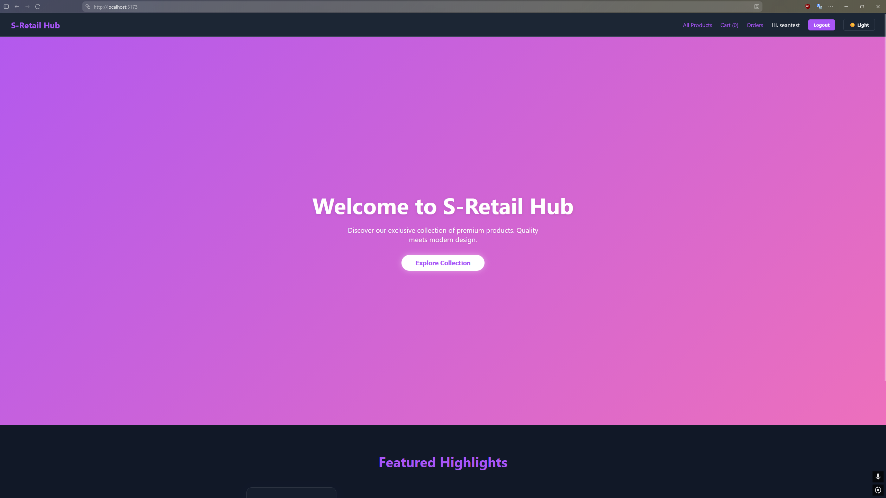
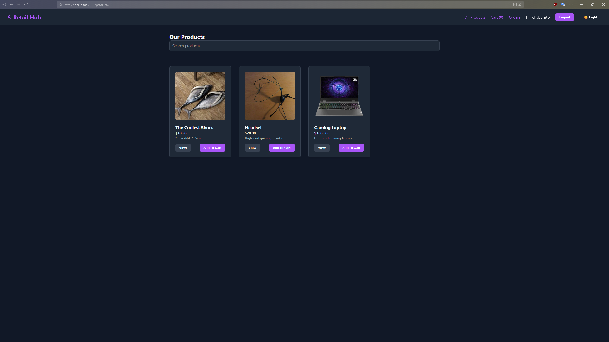
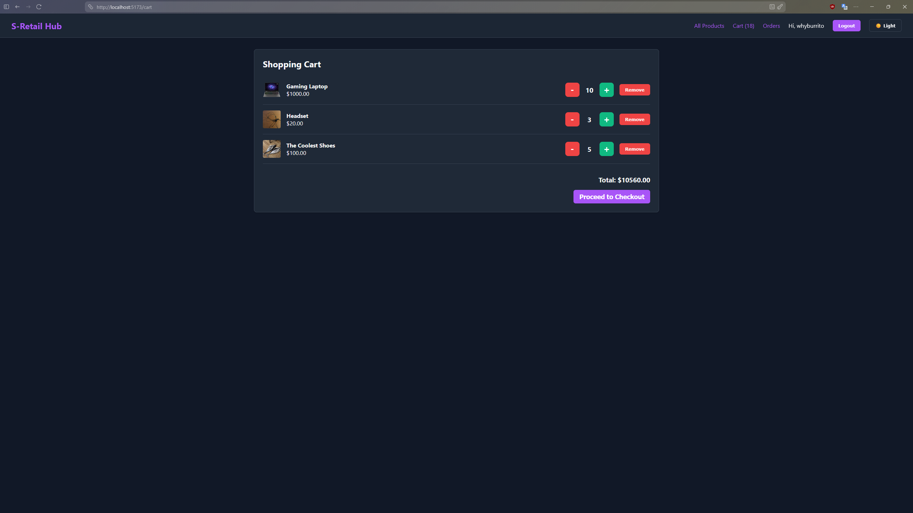
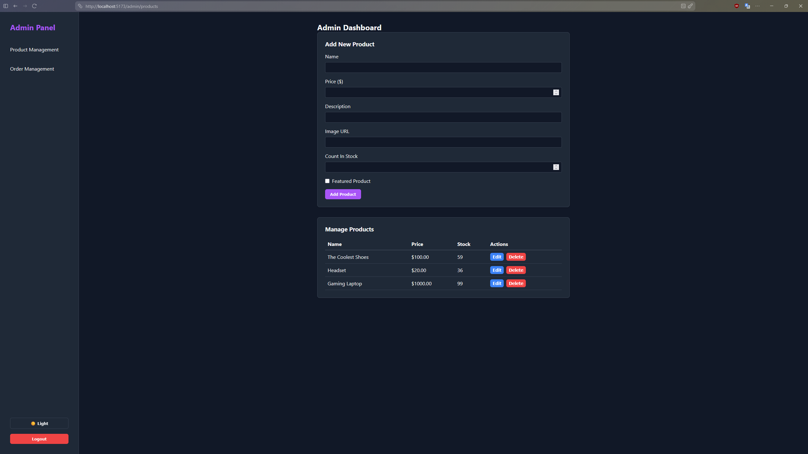
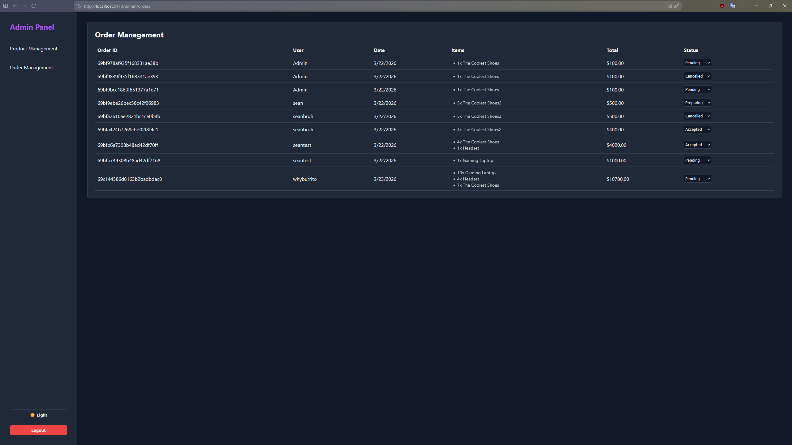

# S-Retail Hub (Web) 🛒

A modern, full-stack e-commerce web application built with the MERN stack (MongoDB, Express, React, Node.js). 

*Featuring a custom "Daytime Inazuma" aesthetic with fluid gradient animations and frosted glassmorphism.*

## 📖 Project Background

This application originated as the final capstone project for my **Web Design and Development 2** coursework. While the baseline requirement was to build a functional MERN storefront, I chose to use this repository as a sandbox to test **AI-Augmented Engineering**. 

By utilizing specialized OpenCode LLM agents, I was able to rapidly scale the backend infrastructure, allowing me to focus my manual engineering efforts on advanced React Context state management, secure role-based routing, and crafting a high-end, custom CSS design system.

## ✨ Features & Showcases

| Dark Mode & UI Polish | The Shopping Cart UX |
| :---: | :---: |
|  |  |
| **Modern UI/UX:** Persistent Light/Dark mode toggle with high-contrast product cards. | **Smart Interactions:** Custom quantity selectors and localized Context API state. |

| Admin Dashboard | Order Tracking |
| :---: | :---: |
|  |  |
| **Role-Based Access:** Protected CRUD operations for inventory and featured products. | **Order Management:** Real-time visibility and status updates for fulfillment. |

### Customer Experience
* **State Management:** Handled entirely via React Context API, persisting data locally so users never lose their items on refresh.
* **Authentication:** Beautifully styled React Modals for login/signup prompts.
* **Order History:** A dedicated dashboard for users to track their order status and cancel pending orders.

### Admin Experience (Protected)
* **Secure Routing:** JWT-based authentication that actively checks for `isAdmin` database flags before granting access.
* **Automated Inventory:** Backend logic that dynamically subtracts stock counts upon successful order creation and rejects orders that exceed available inventory.

## 🛠️ Tech Stack

**Frontend:**
* React 19 + Vite
* React Router v6 (Client-side routing & protected routes)
* React Context API (Global state for Auth and Cart)
* Raw CSS (Custom design system with CSS variables)

**Backend:**
* Node.js & Express.js (RESTful API)
* MongoDB & Mongoose (Database schemas & queries)
* JSON Web Tokens (JWT) & bcrypt (Authentication & Security)

## 🚀 Getting Started

### Prerequisites
* Node.js installed
* A running MongoDB instance (local or Atlas)

### Installation
1. Clone the repository.
2. Navigate to the `/backend` directory, run `npm install`, and create a `.env` file with your `MONGO_URI`, `JWT_SECRET`, and `PORT`.
3. Start the backend server: `npm run dev`
4. Open a new terminal, navigate to the `/frontend` directory, and run `npm install`.
5. Start the Vite development server: `npm run dev`
